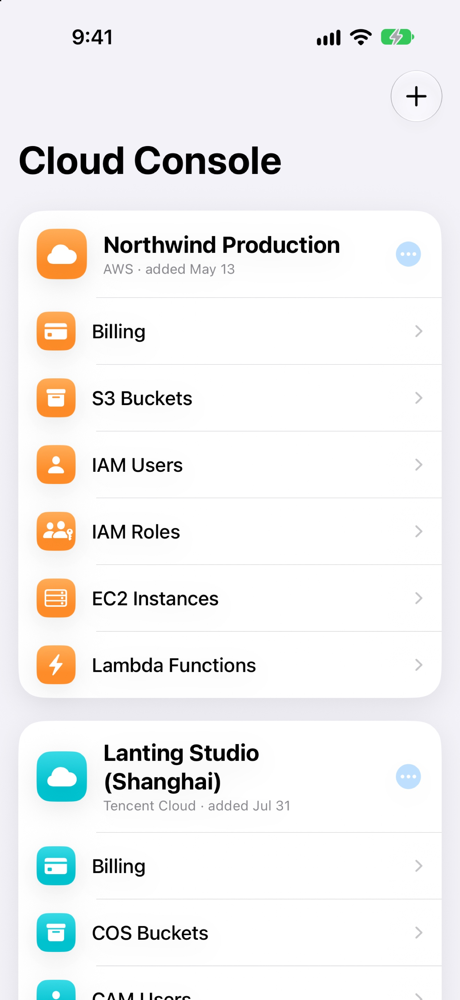
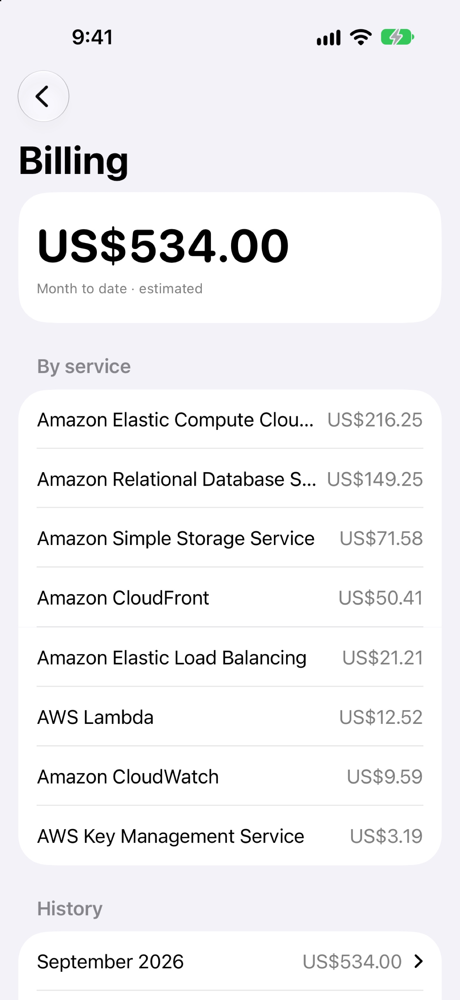
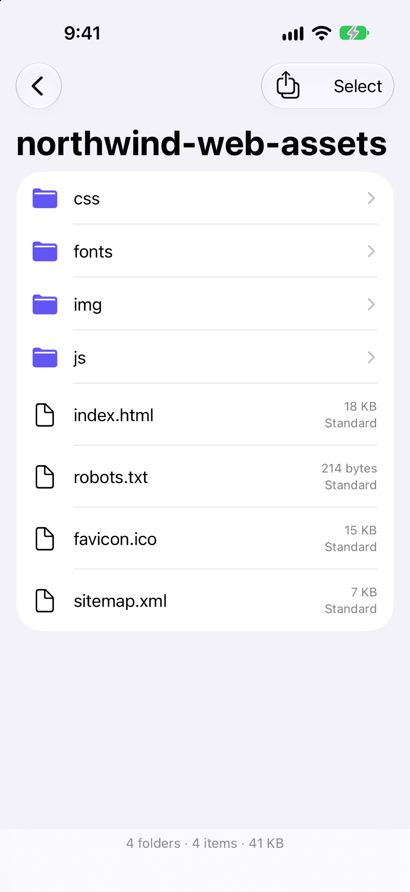
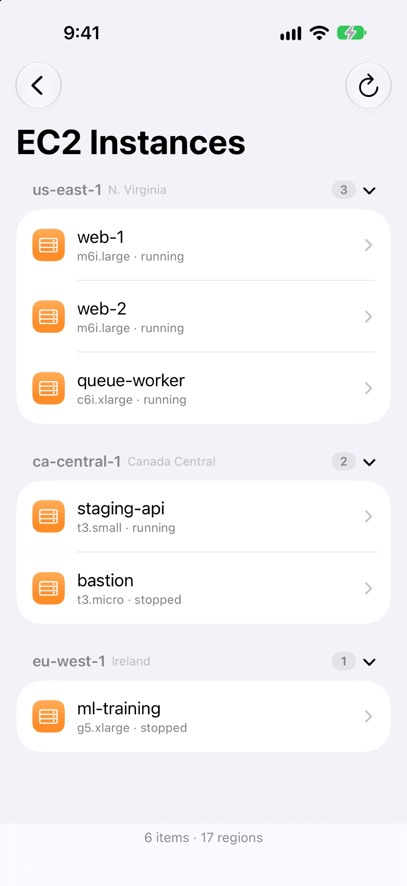
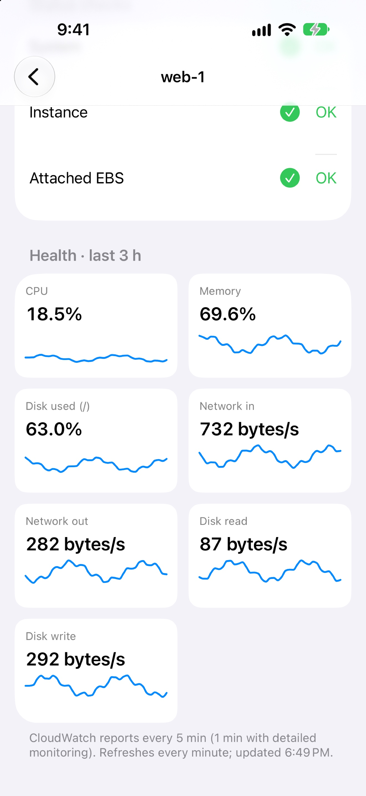
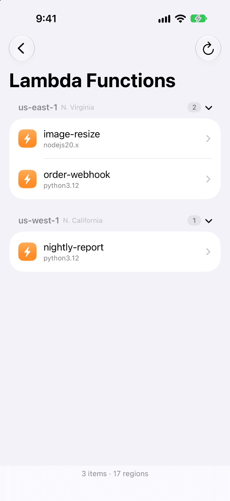
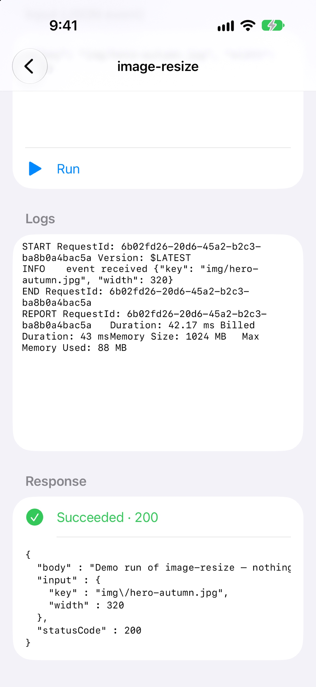
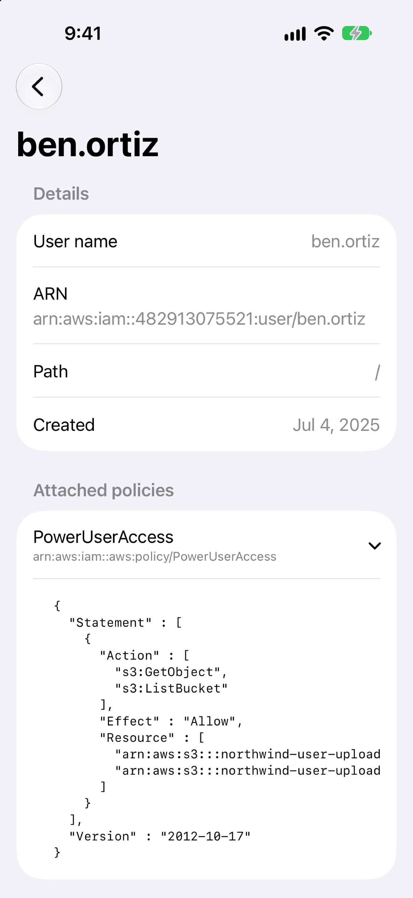
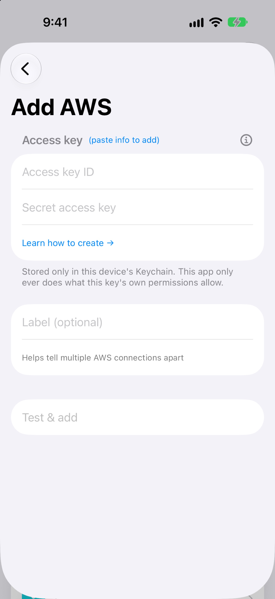
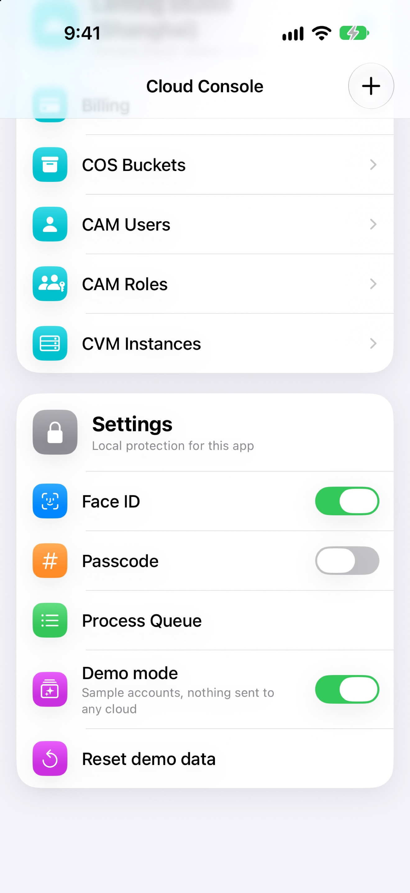

# Cloud Console

A native mobile console for your cloud accounts. Connect with an access
key, browse and manage resources with whatever permissions that key
has — no backend server, no IaC, nothing of ours in between.

## Screenshots

| | | |
|---|---|---|
| **Home**<br> | **Billing**<br> | **S3 bucket**<br> |
| **EC2 by region**<br> | **Instance health**<br> | **Lambda**<br> |
| **Run + live logs**<br> | **IAM policy**<br> | **Add connection**<br> |
| **Settings**<br> |  |  |

## How it works

- **One access key per connection.** Paste in an access key when you
  add a cloud account; that's the only credential involved. The app
  never combines keys, never proxies through a server, never does
  anything the key's own permissions don't already allow.
- **Direct to the provider's API**, signed natively on-device (AWS
  SigV4, Tencent TC3/COS — see `Services/AWSSigV4Signer.swift`, `TC3Signer.swift`). No SDK
  dependency, no third-party service sees your traffic or your key.
- **Keychain only.** Keys never leave the device except in signed
  requests to the provider's own endpoints.

## Providers & resources

Built incrementally, one resource kind at a time. Only implemented ones show in the app.

| Provider | Billing | Storage | Users & roles | Compute | Functions |
|---|---|---|---|---|---|
| AWS | Cost Explorer | S3 (browse, preview, share, upload, copy/move/rename/delete) | IAM + policies | EC2 + status checks, metrics | Lambda: list, run, live logs |
| Tencent Cloud | bill summary, balance | COS | CAM + policies | CVM | — |

Not yet: RDS, EventBridge, alarms, Tencent SCF/CDB; Azure, Google Cloud, Alibaba.

Lambda: run with a JSON input (synchronous, confirmed first) → response. Runtime logs
stream live from `/aws/lambda/<function>` for the current run only, window capped at the function timeout (key needs `logs:FilterLogEvents`).
EC2 and Lambda scan every enabled region (`ec2:DescribeRegions`, else the default 17) one at a time — us-east-1, us-west-1, Canada first — each shown as it finishes, grouped and folded by region with counts; empty regions hidden.

Creating a least-privilege key: [docs/access-keys.md](docs/access-keys.md).

## Setup

Requires [XcodeGen](https://github.com/yonaskolb/XcodeGen).

```
xcodegen generate && open CloudConsole.xcodeproj
```

## Install

```
make device            # STORE=us (Canada/US) by default
make device STORE=cn   # App Store region → Info.plist AppStoreRegion, read via storeRegion()
make sim
```

## Demo

- Settings card → Demo mode: switches instantly to sample connections (an AWS and a Tencent account) with buckets, objects, IAM/CAM users and roles with policies, EC2/CVM instances, and a year of billing. Reset demo data restores the preset.
- Separate store: own connection list, no Keychain, no resource cache, no network. Uploads/copies/moves/deletes are not sent.
- Preset data: `demo/connections.json`, `demo/aws.json`, `demo/tencent.json`, keyed by resource kind. Dates relative: `"@today-3 10:00"`, `"@ymd month-2"`, `"@iso today-9 15:22"`, `{today-3}` inside names.
